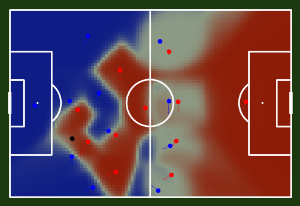
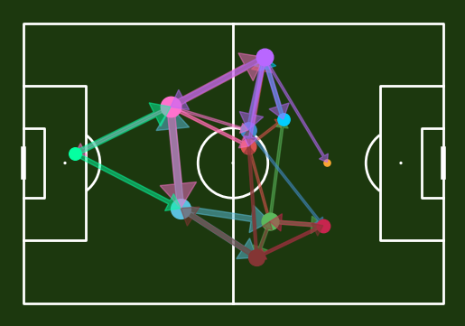

# My Football Analytics

This is supposed to be a collection of code I played around with in the area of football analytics.
It is primarily intended as an overview for me and not necessarily designed for a convenient use for everyone.
Should anyone stumble across this repository by accident, feel free to check it out.
But keep my prior point in mind please and also be aware that I try to give credit where credit is due.
My apologies if I forget to credit someone at any point. :pray:  

I recommend checking out some of the following repositories and creators:

+ Edd Websters brilliant overview on football analytics: https://github.com/eddwebster/football_analytics
+ Floodlight: https://github.com/floodlight-sports/floodlight | https://floodlight.readthedocs.io/en/latest/index.html
+ Friends of Tracking: https://github.com/Friends-of-Tracking-Data-FoTD | https://www.youtube.com/@friendsoftracking755
+ McKay Johns: https://www.youtube.com/@McKayJohns | https://github.com/mckayjohns/youtube-videos

Obviously, there a many others. But these are the ones I relied upon the most on my learning path so far. :muscle:

 

 

 

